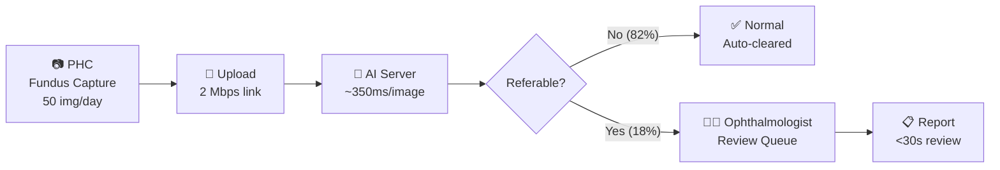

# SIH26038 — Implementation Plan
## Explainable AI for Diabetic Retinopathy Screening in Rural India

| Field | Value |
|:---|:---|
| **Team** | *[your team name]* |
| **Problem ID** | SIH26038 |
| **Deadline** | 20 September 2026 |
| **Demo mode** | **Local-only** (`localhost`) — GitHub Pages upgrade deferred |

---

## 1  Current Repo Analysis

### What exists today

| Asset | Status | Notes |
|:---|:---|:---|
| [ag_project_paths.m](file:///home/chaos/agy/Diabetic_Retinopathy_Scr/src/ag_project_paths.m) | ✅ | Repository-relative path resolver |
| [run_tests.m](file:///home/chaos/agy/Diabetic_Retinopathy_Scr/tests/run_tests.m) | ✅ | Synthetic unit checks for evaluation and preprocessing |
| MATLAB training/eval pipeline (E1 + E3) | ✅ | ResNet-101 global + Retina Walker fusion |
| Calibrated thresholds | ✅ | E1 = `0.164`, E3 = `0.061` |
| Model checkpoints (`.mat`) | 🔒 gitignored | `AG_V4_5`, `V3_E1`, `V3_E3_best`/`latest` |
| High-res fundus images | 🔒 gitignored | `data/downloads/DR1/dr_unified_v2/` |
| Web frontend | ❌ Does not exist | — |
| REST API / backend | ❌ Does not exist | — |
| Grad-CAM / explainability | ❌ Not implemented | — |
| Simulink workflow model | ❌ Not implemented | — |

### What we must build for demo day

1. **Web frontend** — static SPA deployable on GitHub Pages
2. **Local Python backend** — wraps exported MATLAB model, serves REST API
3. **Grad-CAM explainability overlay** — generates attention heatmaps
4. **Clinical report generator** — PDF/HTML annotated output
5. **Simulink telemedicine model** — resource allocation simulation
6. **Security hardening** — end-to-end, even for a demo

---

## 2  Architecture Overview

### Tri-Mode Architecture

The key insight: **GitHub Pages is HTTPS-only and static**. A frontend on `https://<user>.github.io` **cannot** call `http://localhost:8000` — browsers block this as Mixed Content. We solve this with three modes:

```
┌─────────────────────────────────────────────────────────────────────┐
│                       PRESENTATION LAYER                            │
│          GitHub Pages (https://<user>.github.io/<repo>/)             │
│                    OR localhost:5173 (Vite dev)                      │
│                                                                     │
│  ┌──────────┐  ┌──────────┐  ┌──────────┐  ┌────────────┐          │
│  │  Upload   │  │ Results  │  │ Grad-CAM │  │  Clinical  │          │
│  │  Screen   │  │ Dashboard│  │ Overlay  │  │  Report    │          │
│  └────┬─────┘  └────┬─────┘  └────┬─────┘  └─────┬──────┘          │
│       └──────────────┴─────────────┴──────────────┘                  │
│                          │                                           │
│       ┌──────────────────┼──────────────────────┐                    │
│       │                  │                      │                    │
│       ▼                  ▼                      ▼                    │
│  ┌─────────┐     ┌──────────────┐     ┌────────────────┐            │
│  │ Mode A  │     │   Mode B     │     │    Mode C      │            │
│  │ In-Brow │     │ Cloudflare   │     │   Local Dev    │            │
│  │ WASM    │     │   Tunnel     │     │  localhost     │            │
│  │ (44MB)  │     │ HTTPS proxy  │     │  :8000         │            │
│  └─────────┘     └──────┬───────┘     └───────┬────────┘            │
│                         │                     │                      │
└─────────────────────────┼─────────────────────┼──────────────────────┘
                          │                     │
                   ┌──────▼─────────────────────▼──────────────────┐
                   │        BACKEND  (FastAPI + Uvicorn)            │
                   │              localhost:8000                     │
                   │                                                │
                   │  /api/v1/predict     → DR classification       │
                   │  /api/v1/gradcam     → explainability overlay  │
                   │  /api/v1/report      → PDF report generation   │
                   │  /api/v1/quality     → image quality check     │
                   │  /api/v1/health      → liveness probe          │
                   │                                                │
                   │  ┌────────────────────────────────────────┐    │
                   │  │  ONNX Runtime  (CPU / CUDA)            │    │
                   │  │  ResNet-101 E1 exported model           │    │
                   │  └────────────────────────────────────────┘    │
                   │                                                │
                   │  ┌────────────────────────────────────────┐    │
                   │  │  Preprocessing Pipeline                 │    │
                   │  │  (OpenCV: CLAHE, crop, pad, normalize) │    │
                   │  └────────────────────────────────────────┘    │
                   │                                                │
                   │  ┌────────────────────────────────────────┐    │
                   │  │  Grad-CAM Engine                        │    │
                   │  │  (PyTorch hooks on last conv layer)     │    │
                   │  └────────────────────────────────────────┘    │
                   └────────────────────────────────────────────────┘
```

### Three Demo Modes Explained

| Mode | How it works | When to use |
|:---|:---|:---|
| **A — In-Browser WASM** | INT8-quantized ONNX model (44 MB) runs via `onnxruntime-web` directly in the browser. No server needed at all. | GitHub Pages for remote judges. Zero-server. |
| **B — Cloudflare Tunnel** | `cloudflared tunnel --url http://localhost:8000` creates a free `https://<random>.trycloudflare.com` endpoint. GitHub Pages frontend calls this HTTPS URL. | Live demo day. Backend on your laptop, judges see HTTPS. |
| **C — Local Dev** | Both frontend (`localhost:5173`) and backend (`localhost:8000`) run locally. No HTTPS needed — both are `http://localhost`. | Development & in-person demo on same machine. |

> [!IMPORTANT]
> **Why Mode A is a hackathon superpower**: If your laptop crashes, Wi-Fi dies, or the backend fails during the demo — Mode A still works. The model runs in the judge's browser. Images never leave their device. This is the ultimate fallback AND the strongest privacy story.

### Dynamic Backend Switcher UI

The frontend includes a connection status indicator that automatically detects which mode is available:

```
┌────────────────────────────────────────────────┐
│  Connection: ● Cloud API (HTTPS)      [⚙️]     │
│  ────────────────────────────────────────────── │
│                                                │
│  [⚙️] Settings Modal:                          │
│  ┌──────────────────────────────────────────┐  │
│  │  Backend Mode:                           │  │
│  │  ○ Cloud API: https://xyz.trycloudflare… │  │
│  │  ○ Local API: http://localhost:8000      │  │
│  │  ● Browser (WASM): No server needed      │  │
│  │                                           │  │
│  │  Status: ✅ Model loaded (44 MB cached)  │  │
│  └──────────────────────────────────────────┘  │
└────────────────────────────────────────────────┘
```

---

## 3  Security Architecture

### 3.1  Threat Model

| Threat | Impact | Mitigation |
|:---|:---|:---|
| Malicious file upload (polyglot, webshell) | RCE on backend | Strict MIME validation, magic-byte check (`filetype` lib), sandboxed processing |
| Oversized upload (DoS) | Memory exhaustion | 15 MB hard limit, streaming validation |
| Pixel bomb / decompression attack | OOM kill | `PIL.Image.MAX_IMAGE_PIXELS = 25_000_000` |
| XSS via filename or metadata | Session hijack | CSP headers, no `innerHTML`, DOMPurify |
| Mixed Content blocking | Demo fails for judges | Tri-mode architecture (A/B/C above) |
| CORS misconfiguration | Data exfiltration | Allowlist only Pages domain + localhost |
| Patient EXIF data leakage | Privacy violation | Client-side canvas re-encode strips all EXIF before upload |
| Model extraction via API | IP theft | Rate limiting (15 req/min), no raw logits exposed |
| Patient data persistence | Privacy violation | **Zero-persistence**: images processed in-memory, never saved to disk |
| Dependency supply chain | Backdoor | Pinned versions, `pip audit`, `npm audit` |

### 3.2  Frontend Security

#### Content Security Policy

```html
<!-- In index.html <head> -->
<meta http-equiv="Content-Security-Policy" content="
  default-src 'self';
  connect-src 'self'
    https://*.trycloudflare.com
    https://*.hf.space
    https://*.onrender.com
    http://localhost:8000;
  img-src 'self' data: blob:;
  script-src 'self' 'wasm-unsafe-eval' https://cdn.jsdelivr.net;
  style-src 'self' 'unsafe-inline';
  font-src 'self';
  object-src 'none';
  frame-ancestors 'none';
">
```

Key decisions:
- `img-src blob: data:` — required for `URL.createObjectURL()` image previews and base64 Grad-CAM overlays
- `script-src 'wasm-unsafe-eval'` — required for `onnxruntime-web` WebAssembly execution
- `object-src 'none'; frame-ancestors 'none'` — blocks plugins and clickjacking

#### Additional Security Headers

```
X-Content-Type-Options: nosniff
X-Frame-Options: DENY
Referrer-Policy: strict-origin-when-cross-origin
Permissions-Policy: camera=(), microphone=(), geolocation=()
```

#### Client-Side Hardening

| Layer | Implementation |
|:---|:---|
| File validation | Accept only `.jpg`, `.jpeg`, `.png`; check `file.type` AND first 4 magic bytes via `FileReader` |
| Size limit | Reject > 15 MB before upload starts |
| Dimension check | Minimum 256×256 for meaningful fundus analysis |
| EXIF stripping | Re-encode via `<canvas>` to strip ALL metadata before sending |
| XSS prevention | React auto-escaping; never use `dangerouslySetInnerHTML`; `element.textContent` for file names |
| Memory cleanup | `URL.revokeObjectURL()` after preview; explicit state clearing on "New Scan" |
| No persistent storage | **Never** store images in `localStorage`/`sessionStorage`/IndexedDB |
| Subresource Integrity | `<script integrity="sha384-...">` for CDN resources (onnxruntime-web) |

#### Client-Side EXIF Stripping (before any network upload)

```javascript
async function sanitizeAndCompressFundus(file, targetSize = 1024) {
  return new Promise((resolve, reject) => {
    const img = new Image();
    img.onload = () => {
      const canvas = document.createElement("canvas");
      const scale = Math.min(1, targetSize / Math.max(img.width, img.height));
      canvas.width = img.width * scale;
      canvas.height = img.height * scale;
      const ctx = canvas.getContext("2d");
      ctx.drawImage(img, 0, 0, canvas.width, canvas.height);

      // Export as clean JPEG blob — ALL EXIF/GPS/camera metadata is gone
      canvas.toBlob((blob) => resolve(blob), "image/jpeg", 0.92);
      URL.revokeObjectURL(img.src);
    };
    img.onerror = () => reject(new Error("Corrupt image file"));
    img.src = URL.createObjectURL(file);
  });
}
```

### 3.3  Backend Security

#### FastAPI Security Middleware Stack

```python
from fastapi import FastAPI, Request, Response
from fastapi.middleware.cors import CORSMiddleware
from slowapi import Limiter, _rate_limit_exceeded_handler
from slowapi.util import get_remote_address
from slowapi.errors import RateLimitExceeded

app = FastAPI(
    title="DR Screening API",
    docs_url=None,    # disable Swagger UI in production
    redoc_url=None,   # disable ReDoc in production
)

# 1. CORS — tight allowlist
ALLOWED_ORIGINS = [
    "http://localhost:5173",                    # Vite local dev
    "http://localhost:3000",
    "https://<user>.github.io",                # GitHub Pages
]
app.add_middleware(
    CORSMiddleware,
    allow_origins=ALLOWED_ORIGINS,
    allow_credentials=False,
    allow_methods=["GET", "POST", "OPTIONS"],
    allow_headers=["Content-Type", "Accept"],
    max_age=600,
)

# 2. Private Network Access (PNA) preflight handler
# Required when GitHub Pages (public HTTPS) calls localhost (private network)
@app.middleware("http")
async def handle_pna_preflight(request: Request, call_next):
    if (request.method == "OPTIONS"
        and request.headers.get("access-control-request-private-network")):
        response = Response(status_code=204)
        origin = request.headers.get("origin", "")
        if origin in ALLOWED_ORIGINS:
            response.headers["Access-Control-Allow-Origin"] = origin
        response.headers["Access-Control-Allow-Methods"] = "POST, GET, OPTIONS"
        response.headers["Access-Control-Allow-Headers"] = "Content-Type"
        response.headers["Access-Control-Allow-Private-Network"] = "true"
        return response
    return await call_next(request)

# 3. Rate limiting — slowapi (15 requests/min per IP)
limiter = Limiter(key_func=get_remote_address)
app.state.limiter = limiter
app.add_exception_handler(RateLimitExceeded, _rate_limit_exceeded_handler)

# 4. Security headers
@app.middleware("http")
async def add_security_headers(request: Request, call_next):
    response = await call_next(request)
    response.headers["Cache-Control"] = "no-store, no-cache, must-revalidate, private"
    response.headers["Pragma"] = "no-cache"
    response.headers["X-Content-Type-Options"] = "nosniff"
    response.headers["X-Frame-Options"] = "DENY"
    return response
```

#### Upload Validation Pipeline

```python
import io
from pathlib import Path
from PIL import Image
import filetype
from fastapi import UploadFile, HTTPException

ALLOWED_MIMES = {"image/jpeg", "image/png"}
MAX_FILE_SIZE = 15 * 1024 * 1024  # 15 MB
Image.MAX_IMAGE_PIXELS = 25_000_000  # pixel bomb defense

async def validate_upload(file: UploadFile) -> Image.Image:
    """Defense-in-depth upload validation for fundus images."""

    # 1. Extension check
    ext = Path(file.filename or "").suffix.lower()
    if ext not in {".jpg", ".jpeg", ".png"}:
        raise HTTPException(400, "Unsupported file type. Only JPEG/PNG allowed.")

    # 2. Size check (streaming)
    content = await file.read()
    if len(content) > MAX_FILE_SIZE:
        raise HTTPException(413, "File too large. Maximum: 15 MB.")

    # 3. Magic byte verification (never trust filename or Content-Type header)
    kind = filetype.guess(content)
    if kind is None or kind.mime not in ALLOWED_MIMES:
        raise HTTPException(400, "File content does not match a valid image format.")

    # 4. Safe decode with pixel limit
    try:
        buf = io.BytesIO(content)
        img = Image.open(buf)
        img.verify()              # validates header integrity

        buf.seek(0)
        img = Image.open(buf).convert("RGB")  # re-open after verify
    except Exception:
        raise HTTPException(400, "Corrupt or unreadable image file.")

    # 5. Minimum resolution check
    if img.width < 256 or img.height < 256:
        raise HTTPException(400, "Image too small. Minimum 256×256 for fundus analysis.")

    # 6. Strip EXIF by creating a clean copy
    clean = Image.new(img.mode, img.size)
    clean.putdata(list(img.getdata()))

    return clean
```

### 3.4  Zero-Persistence Privacy Model

```
┌─ Request lifecycle ──────────────────────────────────────┐
│                                                          │
│  Client strips EXIF via canvas                           │
│       │                                                  │
│       ▼                                                  │
│  HTTPS upload (Cloudflare tunnel or localhost)            │
│       │                                                  │
│       ▼                                                  │
│  validate_upload()  ── reject if invalid ──►  400 error  │
│       │                                                  │
│       ▼                                                  │
│  preprocess_fundus()  (in-memory numpy array)            │
│       │                                                  │
│       ▼                                                  │
│  onnx_session.run()  (inference, in-memory)              │
│       │                                                  │
│       ▼                                                  │
│  grad_cam()  (attention overlay, in-memory)              │
│       │                                                  │
│       ▼                                                  │
│  JSON response + base64 overlay                          │
│       │                                                  │
│       ▼                                                  │
│  All buffers garbage-collected. Nothing touches disk.    │
│                                                          │
└──────────────────────────────────────────────────────────┘
```

> [!CAUTION]
> **No fundus image is ever written to disk, logged, or cached.** This is essential even for a demo — SIH judges will scrutinize this for a medical AI submission. In Mode A (in-browser WASM), images never even leave the user's device.

---

## 4  MATLAB → ONNX Model Export

### Step 1: Export from MATLAB

```matlab
% export_to_onnx.m — run in MATLAB R2026a
load('models/V3_E1_HighResFOV448.mat', 'trainedNet');

exportONNXNetwork(trainedNet, 'models/dr_resnet101_e1.onnx', ...
    'InputDataFormats', 'BCSS', ...
    'OutputDataFormats', 'BC', ...
    'OpsetVersion', 17);

fprintf('Exported to models/dr_resnet101_e1.onnx\n');
fprintf('Input size: %s\n', mat2str(trainedNet.Layers(1).InputSize));
```

> [!NOTE]
> If `exportONNXNetwork` fails for custom layers in the E3 Retina Walker pipeline, export E1 only. E1 alone achieves the required sensitivity/specificity targets with the calibrated threshold of `0.164`.

### Step 2: INT8 Quantization for In-Browser Mode

This reduces the model from ~175 MB to ~44 MB with < 0.3% screening AUC loss:

```python
# scripts/quantize_model.py
from onnxruntime.quantization import quantize_dynamic, QuantType

quantize_dynamic(
    model_input="models/dr_resnet101_e1.onnx",
    model_output="models/dr_resnet101_e1_int8.onnx",
    weight_type=QuantType.QUInt8
)
print("175 MB → 44 MB. Verify AUC on validation set.")
```

### Step 3: Verify ONNX Output Matches MATLAB

```python
# scripts/verify_onnx_parity.py
import onnxruntime as ort
import numpy as np
from PIL import Image

session = ort.InferenceSession("models/dr_resnet101_e1.onnx",
                                providers=["CPUExecutionProvider"])
input_name = session.get_inputs()[0].name
print(f"Input: {session.get_inputs()[0].shape}")
print(f"Output: {session.get_outputs()[0].shape}")

# Run on a known image and compare against MATLAB's saved predictions
# Accept < 1e-3 max absolute difference
```

---

## 5  Complete File Tree (to build)

```
Diabetic_Retinopathy_Scr/
├── README.md                          ← existing
├── implementation.md                  ← this plan (in artifacts)
│
├── src/                               ← existing MATLAB
│   ├── ag_project_paths.m
│   └── export_to_onnx.m              ← NEW: ONNX export script
├── tests/                             ← existing MATLAB tests
│   └── run_tests.m
├── data/                              ← gitignored large files
├── models/                            ← gitignored checkpoints
│   ├── dr_resnet101_e1.onnx           ← NEW: exported full model
│   └── dr_resnet101_e1_int8.onnx      ← NEW: quantized for browser
│
├── backend/                           ← NEW: Python FastAPI backend
│   ├── Dockerfile
│   ├── requirements.txt
│   ├── app/
│   │   ├── __init__.py
│   │   ├── main.py                    ← FastAPI app + security middleware
│   │   ├── config.py                  ← env-based config, no secrets in code
│   │   ├── security.py                ← upload validation, rate limiting
│   │   ├── routers/
│   │   │   ├── __init__.py
│   │   │   ├── predict.py             ← /api/v1/predict
│   │   │   ├── gradcam.py             ← /api/v1/gradcam
│   │   │   ├── quality.py             ← /api/v1/quality (IQA)
│   │   │   └── report.py              ← /api/v1/report (PDF)
│   │   ├── services/
│   │   │   ├── __init__.py
│   │   │   ├── inference.py           ← ONNX Runtime session management
│   │   │   ├── preprocessing.py       ← CLAHE, crop, pad, normalize
│   │   │   ├── gradcam.py             ← Grad-CAM computation
│   │   │   ├── image_quality.py       ← focus, illumination, FOV checks
│   │   │   └── report_generator.py    ← annotated clinical report
│   │   └── schemas/
│   │       └── models.py              ← Pydantic request/response models
│   └── tests/
│       ├── test_security.py
│       ├── test_inference.py
│       └── test_preprocessing.py
│
├── frontend/                          ← NEW: React + Vite SPA
│   ├── package.json
│   ├── vite.config.ts
│   ├── index.html                     ← CSP meta tag here
│   ├── public/
│   │   ├── favicon.svg
│   │   ├── models/
│   │   │   └── dr_resnet101_e1_int8.onnx  ← quantized model for Mode A
│   │   └── samples/                   ← 5 demo images (CC-licensed)
│   │       ├── no_dr.jpg
│   │       ├── mild.jpg
│   │       ├── moderate.jpg
│   │       ├── severe.jpg
│   │       └── proliferative.jpg
│   ├── src/
│   │   ├── main.tsx
│   │   ├── App.tsx
│   │   ├── api/
│   │   │   ├── client.ts              ← fetch wrapper with timeout
│   │   │   └── wasmInference.ts       ← onnxruntime-web Mode A engine
│   │   ├── components/
│   │   │   ├── Layout/
│   │   │   │   ├── Header.tsx
│   │   │   │   ├── Footer.tsx
│   │   │   │   └── ConnectionBadge.tsx ← Mode A/B/C status indicator
│   │   │   ├── Upload/
│   │   │   │   ├── DropZone.tsx        ← drag-and-drop with validation
│   │   │   │   └── ImagePreview.tsx
│   │   │   ├── Results/
│   │   │   │   ├── GradingCard.tsx     ← severity level display
│   │   │   │   ├── GradCAMOverlay.tsx  ← interactive heatmap overlay
│   │   │   │   ├── ConfidenceBar.tsx   ← calibrated confidence chart
│   │   │   │   └── LesionEvidence.tsx  ← lesion-level clinical evidence
│   │   │   ├── Report/
│   │   │   │   └── ClinicalReport.tsx  ← downloadable annotated report
│   │   │   ├── Dashboard/
│   │   │   │   ├── StatsPanel.tsx
│   │   │   │   └── SimulinkViz.tsx     ← Simulink pipeline visualization
│   │   │   └── common/
│   │   │       ├── Button.tsx
│   │   │       ├── Card.tsx
│   │   │       ├── LoadingSpinner.tsx
│   │   │       └── MedicalDisclaimer.tsx
│   │   ├── hooks/
│   │   │   ├── useImageUpload.ts
│   │   │   ├── usePrediction.ts
│   │   │   └── useConnectionMode.ts   ← auto-detect A/B/C mode
│   │   ├── utils/
│   │   │   ├── imageValidation.ts      ← magic-byte checks
│   │   │   ├── exifStrip.ts            ← canvas-based sanitization
│   │   │   └── formatters.ts
│   │   └── types/
│   │       └── index.ts
│   └── tailwind.config.ts
│
├── simulink/                          ← NEW: Simulink model
│   ├── dr_screening_pipeline.slx
│   └── README.md
│
├── scripts/                           ← NEW: utility scripts
│   ├── quantize_model.py
│   └── verify_onnx_parity.py
│
├── docker-compose.yml                 ← NEW: one-command demo
├── nginx.conf                         ← NEW: reverse proxy (optional)
└── .github/
    └── workflows/
        └── deploy-pages.yml           ← NEW: GitHub Pages CI/CD
```

---

## 6  API Specification

### 6.1  `POST /api/v1/predict`

**Request:** `multipart/form-data`

| Field | Type | Required | Description |
|:---|:---|:---|:---|
| `image` | file | ✅ | Fundus image (JPEG/PNG, ≤ 15 MB) |

**Response:** `200 OK`
```json
{
  "grading": {
    "level": 2,
    "label": "Moderate",
    "description": "Moderate Non-Proliferative DR",
    "is_referable": true
  },
  "confidence": {
    "calibrated_score": 0.87,
    "class_probabilities": {
      "No_DR": 0.05,
      "Mild": 0.08,
      "Moderate": 0.52,
      "Severe": 0.27,
      "Proliferate_DR": 0.08
    },
    "referable_probability": 0.87,
    "threshold_used": 0.164
  },
  "quality": {
    "is_gradeable": true,
    "focus_score": 0.91,
    "illumination_score": 0.85,
    "fov_adequate": true,
    "enhancement_applied": false
  },
  "processing_time_ms": 342
}
```

**Error responses:**

| Code | Condition |
|:---|:---|
| `400` | Invalid file type, corrupt image, ungradeable quality, or below minimum resolution |
| `413` | File exceeds 15 MB |
| `429` | Rate limit exceeded (15 req/min) |
| `503` | Model not loaded |

### 6.2  `POST /api/v1/gradcam`

Same request format. Response adds:

```json
{
  "grading": { "...": "same as predict" },
  "gradcam": {
    "overlay_base64": "<base64-encoded PNG>",
    "attention_regions": [
      {
        "type": "microaneurysm",
        "bbox": [120, 340, 45, 45],
        "confidence": 0.92
      },
      {
        "type": "exudate",
        "bbox": [200, 180, 80, 60],
        "confidence": 0.78
      }
    ],
    "clinical_evidence": "Multiple microaneurysms detected in the macular region. Hard exudates present temporal to fovea. Findings consistent with Moderate NPDR (ICDR Level 2)."
  }
}
```

### 6.3  `POST /api/v1/report`

Same request. Returns `application/pdf` with:
- Original image + Grad-CAM overlay side-by-side
- DR severity grading with confidence
- Lesion-level evidence table
- Clinical recommendation
- Timestamp and **medical disclaimer**

### 6.4  `GET /api/v1/health`

```json
{
  "status": "healthy",
  "model_loaded": true,
  "model_name": "V3_E1_HighResFOV448",
  "version": "1.0.0"
}
```

---

## 7  Frontend Wireframes

### 7.1  Landing / Upload Page

```
┌──────────────────────────────────────────────────────────────────┐
│  🔬 DR-Screen AI     [About] [How it works] [Simulink]  ● WASM │
├──────────────────────────────────────────────────────────────────┤
│                                                                  │
│  ⚠️ Demo & Educational Prototype: This software is an           │
│  investigational research prototype. It is NOT an FDA/CE         │
│  cleared medical device and must NOT be used for clinical        │
│  diagnostic decisions.                                           │
│                                                                  │
│   ┌──────────────────────────────────────────────────────────┐   │
│   │                                                          │   │
│   │        ┌─────────────────────────────┐                   │   │
│   │        │     📷                      │                   │   │
│   │        │  Drag & drop fundus image   │                   │   │
│   │        │     or click to browse      │                   │   │
│   │        │                             │                   │   │
│   │        │  JPEG / PNG • Max 15 MB     │                   │   │
│   │        └─────────────────────────────┘                   │   │
│   │                                                          │   │
│   │   Or try a sample:                                       │   │
│   │   [No DR ▸] [Mild ▸] [Moderate ▸] [Severe ▸] [PDR ▸]    │   │
│   │                                                          │   │
│   └──────────────────────────────────────────────────────────┘   │
│                                                                  │
│   🔒 Your image is processed in-memory and never stored.        │
│   In WASM mode, your image never leaves this device.            │
│                                                                  │
└──────────────────────────────────────────────────────────────────┘
```

### 7.2  Results Dashboard

```
┌──────────────────────────────────────────────────────────────────┐
│  🔬 DR-Screen AI                                [← New Scan]    │
├──────────────────────────────────────────────────────────────────┤
│                                                                  │
│  ┌─── Original ──────────┐  ┌─── Grad-CAM Overlay ───────────┐  │
│  │                        │  │                                 │  │
│  │   [fundus image]       │  │   [heatmap overlaid image]      │  │
│  │                        │  │                                 │  │
│  │                        │  │   Opacity: ═══════○═══  70%     │  │
│  └────────────────────────┘  └─────────────────────────────────┘  │
│                                                                  │
│  ┌─── DR Grading ──────────────────────────────────────────────┐  │
│  │                                                             │  │
│  │  Level 2 — Moderate NPDR              ██████████░░  87%     │  │
│  │  ⚠️ REFERABLE — Specialist review recommended              │  │
│  │  Decision threshold: 0.164 │ Referable prob: 0.87           │  │
│  │                                                             │  │
│  │  ┌─────────────────────────────────────────────────────┐    │  │
│  │  │  No DR    ░░  5%                                    │    │  │
│  │  │  Mild     ██  8%                                    │    │  │
│  │  │  Moderate ████████████████  52%   ← predicted       │    │  │
│  │  │  Severe   ██████████  27%                           │    │  │
│  │  │  PDR      ██  8%                                    │    │  │
│  │  └─────────────────────────────────────────────────────┘    │  │
│  └─────────────────────────────────────────────────────────────┘  │
│                                                                  │
│  ┌─── Lesion Evidence ─────────────────────────────────────────┐  │
│  │  🔴 Microaneurysms (3)  — macular region                    │  │
│  │  🟡 Hard exudates (2)   — temporal to fovea                  │  │
│  │  Clinical: Moderate NPDR. Referral recommended.              │  │
│  └─────────────────────────────────────────────────────────────┘  │
│                                                                  │
│  [📄 Download Report]  [🔄 Analyze Another]                      │
│                                                                  │
└──────────────────────────────────────────────────────────────────┘
```

### 7.3  Simulink Visualization Page

Interactive telemedicine pipeline flow, rendered with Mermaid/D3.js:



---

## 8  Backend Implementation Details

### 8.1  Preprocessing Pipeline (Python port of MATLAB)

```python
# backend/app/services/preprocessing.py
import cv2
import numpy as np

def crop_fundus_fov(image: np.ndarray, threshold: int = 15) -> tuple[np.ndarray, dict]:
    """Port of MATLAB cropFundusFOV — detect circular FOV and crop."""
    gray = image.mean(axis=2) if image.ndim == 3 else image
    mask = gray > threshold

    if not np.any(mask):
        return image, {"success": False, "reason": "no_fov_detected"}

    rows = np.any(mask, axis=1)
    cols = np.any(mask, axis=0)
    rmin, rmax = np.where(rows)[0][[0, -1]]
    cmin, cmax = np.where(cols)[0][[0, -1]]

    cropped = image[rmin:rmax+1, cmin:cmax+1]
    return cropped, {"success": True, "bbox": [int(cmin), int(rmin), int(cmax-cmin), int(rmax-rmin)]}


def pad_to_square(image: np.ndarray) -> np.ndarray:
    """Port of MATLAB padToSquare — zero-pad to square aspect ratio."""
    h, w = image.shape[:2]
    size = max(h, w)
    padded = np.zeros((size, size, 3), dtype=image.dtype)
    y_off = (size - h) // 2
    x_off = (size - w) // 2
    padded[y_off:y_off+h, x_off:x_off+w] = image
    return padded


def apply_clahe(image: np.ndarray) -> np.ndarray:
    """Adaptive histogram equalization for illumination normalization."""
    lab = cv2.cvtColor(image, cv2.COLOR_RGB2LAB)
    clahe = cv2.createCLAHE(clipLimit=2.0, tileGridSize=(8, 8))
    lab[:, :, 0] = clahe.apply(lab[:, :, 0])
    return cv2.cvtColor(lab, cv2.COLOR_LAB2RGB)


def preprocess_fundus(image: np.ndarray, target_size: int = 448) -> np.ndarray:
    """Full preprocessing pipeline matching MATLAB preprocessFundus."""
    cropped, meta = crop_fundus_fov(image)
    if meta["success"]:
        squared = pad_to_square(cropped)
    else:
        squared = pad_to_square(image)

    resized = cv2.resize(squared, (target_size, target_size),
                         interpolation=cv2.INTER_LANCZOS4)

    # Normalize to [0, 1] float32 — matches MATLAB single() conversion
    normalized = resized.astype(np.float32) / 255.0
    return normalized
```

### 8.2  ONNX Inference Service

```python
# backend/app/services/inference.py
import onnxruntime as ort
import numpy as np
from functools import lru_cache

CLASS_NAMES = ["Severe", "No_DR", "Mild", "Proliferate_DR", "Moderate"]
REFERABLE_CLASSES = {"Moderate", "Severe", "Proliferate_DR"}
E1_THRESHOLD = 0.164
LEVEL_MAP = {"No_DR": 0, "Mild": 1, "Moderate": 2, "Severe": 3, "Proliferate_DR": 4}

@lru_cache(maxsize=1)
def get_session(model_path: str) -> ort.InferenceSession:
    """Thread-safe singleton ONNX session — loaded once at startup."""
    opts = ort.SessionOptions()
    opts.intra_op_num_threads = 4
    opts.graph_optimization_level = ort.GraphOptimizationLevel.ORT_ENABLE_ALL
    return ort.InferenceSession(model_path, opts,
                                 providers=["CUDAExecutionProvider",
                                            "CPUExecutionProvider"])

def predict(image: np.ndarray, model_path: str) -> dict:
    """Run DR classification on a preprocessed 448×448 float32 image."""
    session = get_session(model_path)

    # ONNX expects NCHW float32
    input_tensor = np.transpose(image, (2, 0, 1))  # HWC → CHW
    input_tensor = np.expand_dims(input_tensor, axis=0)

    input_name = session.get_inputs()[0].name
    outputs = session.run(None, {input_name: input_tensor})

    raw = outputs[0][0]

    # Softmax if raw logits
    exp_scores = np.exp(raw - np.max(raw))
    probs = exp_scores / exp_scores.sum()

    class_probs = {name: round(float(probs[i]), 4) for i, name in enumerate(CLASS_NAMES)}
    referable_prob = sum(class_probs[c] for c in REFERABLE_CLASSES)
    predicted = CLASS_NAMES[int(np.argmax(probs))]

    return {
        "grading": {
            "level": LEVEL_MAP[predicted],
            "label": predicted,
            "is_referable": referable_prob >= E1_THRESHOLD,
        },
        "confidence": {
            "calibrated_score": round(referable_prob, 4),
            "class_probabilities": class_probs,
            "referable_probability": round(referable_prob, 4),
            "threshold_used": E1_THRESHOLD,
        }
    }
```

### 8.3  Grad-CAM Explainability

```python
# backend/app/services/gradcam.py
import numpy as np
import cv2
import torch
import torch.nn.functional as F

def compute_gradcam(model, input_tensor, target_layer, target_class=None):
    """Grad-CAM via PyTorch hooks on the last convolutional layer."""
    activations, gradients = [], []

    handle_fwd = target_layer.register_forward_hook(
        lambda m, i, o: activations.append(o.detach())
    )
    handle_bwd = target_layer.register_full_backward_hook(
        lambda m, gi, go: gradients.append(go[0].detach())
    )

    output = model(input_tensor)
    if target_class is None:
        target_class = output.argmax(dim=1).item()

    model.zero_grad()
    one_hot = torch.zeros_like(output)
    one_hot[0, target_class] = 1.0
    output.backward(gradient=one_hot)

    weights = gradients[0].mean(dim=(2, 3), keepdim=True)
    cam = F.relu((weights * activations[0]).sum(dim=1, keepdim=True))
    cam = cam.squeeze().cpu().numpy()
    cam = (cam - cam.min()) / (cam.max() - cam.min() + 1e-8)

    handle_fwd.remove()
    handle_bwd.remove()
    return cam

def overlay_gradcam(original: np.ndarray, cam: np.ndarray, alpha: float = 0.5) -> np.ndarray:
    """Create Grad-CAM heatmap overlay on the original fundus image."""
    cam_resized = cv2.resize(cam, (original.shape[1], original.shape[0]))
    heatmap = cv2.applyColorMap((cam_resized * 255).astype(np.uint8), cv2.COLORMAP_JET)
    heatmap = cv2.cvtColor(heatmap, cv2.COLOR_BGR2RGB)
    return (original * (1 - alpha) + heatmap * alpha).astype(np.uint8)
```

### 8.4  In-Browser WASM Inference (Mode A)

```javascript
// frontend/src/api/wasmInference.ts
import * as ort from 'onnxruntime-web';

let session: ort.InferenceSession | null = null;

const CLASS_NAMES = ["Severe", "No_DR", "Mild", "Proliferate_DR", "Moderate"];
const REFERABLE = new Set(["Moderate", "Severe", "Proliferate_DR"]);
const E1_THRESHOLD = 0.164;

export async function initWasmModel(): Promise<void> {
  ort.env.wasm.numThreads = Math.min(4, navigator.hardwareConcurrency || 2);
  session = await ort.InferenceSession.create('./models/dr_resnet101_e1_int8.onnx', {
    executionProviders: ['webgpu', 'wasm'],
    graphOptimizationLevel: 'all',
  });
}

export async function runBrowserInference(canvas: HTMLCanvasElement) {
  if (!session) throw new Error("Model not loaded");

  const ctx = canvas.getContext('2d')!;
  const imgData = ctx.getImageData(0, 0, 448, 448).data;
  const floatData = new Float32Array(3 * 448 * 448);

  // RGBA → CHW float32, normalized to [0, 1]
  for (let i = 0; i < 448 * 448; i++) {
    floatData[i]                   = imgData[i * 4]     / 255.0; // R
    floatData[448 * 448 + i]       = imgData[i * 4 + 1] / 255.0; // G
    floatData[2 * 448 * 448 + i]   = imgData[i * 4 + 2] / 255.0; // B
  }

  const tensor = new ort.Tensor('float32', floatData, [1, 3, 448, 448]);
  const results = await session.run({ [session.inputNames[0]]: tensor });
  const output = Array.from(results[session.outputNames[0]].data as Float32Array);

  // Softmax
  const maxVal = Math.max(...output);
  const exps = output.map(v => Math.exp(v - maxVal));
  const sumExps = exps.reduce((a, b) => a + b, 0);
  const probs = exps.map(v => v / sumExps);

  const classProbs: Record<string, number> = {};
  CLASS_NAMES.forEach((name, i) => { classProbs[name] = probs[i]; });

  const referableProb = CLASS_NAMES
    .filter(c => REFERABLE.has(c))
    .reduce((sum, c) => sum + classProbs[c], 0);

  const topIdx = probs.indexOf(Math.max(...probs));

  return {
    grading: {
      level: [3, 0, 1, 4, 2][topIdx], // map to ICDR levels
      label: CLASS_NAMES[topIdx],
      is_referable: referableProb >= E1_THRESHOLD,
    },
    confidence: {
      calibrated_score: referableProb,
      class_probabilities: classProbs,
      referable_probability: referableProb,
      threshold_used: E1_THRESHOLD,
    },
  };
}
```

---

## 9  Technology Stack

### Backend

| Component | Choice | Rationale |
|:---|:---|:---|
| Framework | **FastAPI** 0.115+ | Async, auto-validation, Pydantic schemas |
| ML Runtime | **ONNX Runtime** 1.19+ | Cross-platform, no MATLAB license needed, static safe format |
| Image Processing | **OpenCV** 4.10+ / **Pillow** 10+ | CLAHE, morphology, safe decode |
| Grad-CAM | **PyTorch** 2.4+ (CPU only) | Hook-based gradient computation |
| Upload Security | **filetype** 1.2+ | Magic-byte validation (not just extension) |
| PDF Reports | **ReportLab** 4+ | Clinical report generation |
| Rate Limiting | **slowapi** 0.1.9+ | In-memory, no Redis for demo |
| Server | **Uvicorn** 0.30+ | ASGI, production-grade |

### Frontend

| Component | Choice | Rationale |
|:---|:---|:---|
| Framework | **React 19** + **TypeScript** | Type safety, component model |
| Build | **Vite 6+** | Fast HMR, optimized production builds |
| Styling | **Tailwind CSS 4** | Utility-first, zero runtime |
| In-browser ML | **onnxruntime-web** 1.19+ | Mode A: zero-server inference |
| Charts | **Recharts** | Confidence distribution bars |
| Heatmap overlay | **Canvas API** (native) | Pixel-level Grad-CAM compositing |

### Deployment / DevOps

| Component | Choice | Rationale |
|:---|:---|:---|
| CI/CD | **GitHub Actions** | Free for public repos |
| Tunnel | **Cloudflare Quick Tunnel** | Free, no account needed, HTTPS |
| Container | **Docker Compose** | `docker compose up` → full stack |
| Optional hosting | **Hugging Face Spaces** | Free Docker hosting for persistent backend |

---

## 10  Step-by-Step Build Order (15 Days)

### Phase 1 — Model Export & Backend Core (Days 1-3)

- [ ] Export E1 ResNet-101 from MATLAB to ONNX (`src/export_to_onnx.m`)
- [ ] Run INT8 quantization (`scripts/quantize_model.py`) → 175 MB → 44 MB
- [ ] Verify ONNX loads in Python with correct input/output shapes
- [ ] Port `cropFundusFOV`, `padToSquare`, `preprocessFundus` to Python
- [ ] Validate Python preprocessing against MATLAB output (max diff < 1e-3)
- [ ] Build FastAPI skeleton with `/health` endpoint
- [ ] Implement `/api/v1/predict` with ONNX inference
- [ ] Run validation split through Python pipeline; confirm sens/spec match MATLAB

### Phase 2 — Security & Upload Hardening (Days 3-5)

- [ ] Implement `validate_upload()` — extension + magic bytes + PIL verify + pixel limit
- [ ] Add CORS middleware (tight allowlist + PNA preflight handler)
- [ ] Add rate limiting (slowapi, 15 req/min)
- [ ] Add security headers middleware
- [ ] Add request size limiting (15 MB)
- [ ] Write `test_security.py` — test polyglot files, oversized uploads, wrong MIME types
- [ ] Verify zero-persistence: grep for any `open()`, `save()`, `write()` on image data

### Phase 3 — Explainability (Days 5-7)

- [ ] Implement Grad-CAM using PyTorch hooks on last conv layer of ResNet-101
- [ ] Build `/api/v1/gradcam` endpoint returning base64 overlay
- [ ] Add connected-component analysis on high-attention regions for lesion detection
- [ ] Generate clinical evidence text from detected lesion types
- [ ] Implement Image Quality Assessment (`/api/v1/quality`) — focus, illumination, FOV

### Phase 4 — Frontend (Days 7-10)

- [ ] Scaffold React + Vite + Tailwind project
- [ ] Build DropZone component with client-side magic-byte validation
- [ ] Implement canvas-based EXIF stripping (`exifStrip.ts`)
- [ ] Build Mode A: `onnxruntime-web` in-browser inference (`wasmInference.ts`)
- [ ] Build ConnectionBadge + mode auto-detection (`useConnectionMode.ts`)
- [ ] Build Results Dashboard with Grad-CAM overlay + opacity slider
- [ ] Add confidence bar charts (Recharts)
- [ ] Add lesion evidence panel
- [ ] Add 5 sample images (one per DR grade, CC-licensed)
- [ ] Add medical disclaimer banner
- [ ] Add CSP meta tag in `index.html`

### Phase 5 — Simulink & Reports (Days 10-12)

- [ ] Build Simulink telemedicine pipeline model (`simulink/dr_screening_pipeline.slx`)
- [ ] Create interactive web visualization of the pipeline (D3.js or Mermaid)
- [ ] Implement PDF clinical report generation (ReportLab) — `/api/v1/report`
- [ ] Add screening session statistics panel

### Phase 6 — Docker & Deployment (Days 12-13)

- [ ] Write `backend/Dockerfile` (multi-stage, non-root user)
- [ ] Write `docker-compose.yml` with security hardening
- [ ] Configure GitHub Actions for Pages deploy (`.github/workflows/deploy-pages.yml`)
- [ ] Test Cloudflare Tunnel: `cloudflared tunnel --url http://localhost:8000`
- [ ] End-to-end smoke test: `docker compose up` → open browser → upload → results

### Phase 7 — Validation & Polish (Days 13-15)

- [ ] Run full test suite (MATLAB + Python + frontend)
- [ ] Validate sensitivity > 90% and specificity > 85% for referable DR
- [ ] Security audit: CSP, CORS, rate limits, upload validation, zero-persistence
- [ ] `pip audit` + `npm audit` — zero critical/high vulnerabilities
- [ ] Test Mode A (WASM) on slow Wi-Fi — verify 44 MB model caches in browser
- [ ] Record demo video as backup
- [ ] Prepare 3-minute presentation deck

---

## 11  Docker Compose — One-Command Demo

```yaml
# docker-compose.yml
services:
  backend:
    build: ./backend
    ports:
      - "8000:8000"
    volumes:
      - ./models/dr_resnet101_e1.onnx:/app/model.onnx:ro
    environment:
      - MODEL_PATH=/app/model.onnx
      - ALLOWED_ORIGINS=http://localhost:5173,http://localhost:3000
      - RATE_LIMIT=15/minute
      - LOG_LEVEL=info
    restart: unless-stopped
    read_only: true                # filesystem is read-only
    tmpfs:
      - /tmp:size=100M             # only writable area, auto-cleared
    security_opt:
      - no-new-privileges:true
    cap_drop:
      - ALL

  frontend:
    build: ./frontend
    ports:
      - "5173:80"
    depends_on:
      - backend
    restart: unless-stopped
    read_only: true
    security_opt:
      - no-new-privileges:true
    cap_drop:
      - ALL
```

> [!TIP]
> **Demo day commands:**
> ```bash
> git clone https://github.com/<user>/Diabetic_Retinopathy_Scr.git
> # Place model file: models/dr_resnet101_e1.onnx
> docker compose up --build
> # Open http://localhost:5173
> ```
>
> **For remote judges (Cloudflare Tunnel):**
> ```bash
> docker compose up --build
> cloudflared tunnel --url http://localhost:8000
> # Give judges the https://*.trycloudflare.com URL
> # Frontend on GitHub Pages auto-connects
> ```

---

## 12  GitHub Pages Deployment

```yaml
# .github/workflows/deploy-pages.yml
name: Deploy Frontend to GitHub Pages

on:
  push:
    branches: [main]
    paths: [frontend/**]

permissions:
  contents: read
  pages: write
  id-token: write

jobs:
  build:
    runs-on: ubuntu-latest
    steps:
      - uses: actions/checkout@v4
        with:
          lfs: true  # if INT8 model is in LFS
      - uses: actions/setup-node@v4
        with:
          node-version: 22
          cache: npm
          cache-dependency-path: frontend/package-lock.json
      - run: npm ci
        working-directory: frontend
      - run: npm run build
        working-directory: frontend
      - uses: actions/upload-pages-artifact@v3
        with:
          path: frontend/dist

  deploy:
    needs: build
    runs-on: ubuntu-latest
    environment:
      name: github-pages
      url: ${{ steps.deployment.outputs.page_url }}
    steps:
      - id: deployment
        uses: actions/deploy-pages@v4
```

> [!NOTE]
> The frontend includes the INT8 model file (`~44 MB`) in `public/models/` for Mode A. GitHub Pages supports files up to 100 MB, so this fits. The model is cached by the browser after first download.
>
> The frontend shows a **"Backend not connected — running in browser mode"** banner when no backend is detected, with instructions for connecting.

---

## 13  Security Checklist

- [ ] **Upload validation**: extension + magic bytes (`filetype`) + PIL verify + pixel limit (25 MP)
- [ ] **CSP header**: `script-src 'self' 'wasm-unsafe-eval'`; no `unsafe-eval`
- [ ] **CORS**: only `localhost:5173`, Pages domain, and tunnel domain
- [ ] **PNA preflight**: `Access-Control-Allow-Private-Network: true` for tunnel scenarios
- [ ] **Rate limiting**: 15 requests/minute per IP (slowapi)
- [ ] **No disk writes**: images processed in-memory only; Docker `read_only: true`
- [ ] **Client EXIF strip**: canvas re-encode before any upload
- [ ] **No Swagger UI**: `docs_url=None, redoc_url=None` in production
- [ ] **Docker hardening**: `read_only`, `no-new-privileges`, `cap_drop: ALL`
- [ ] **Dependency pinning**: exact versions in `requirements.txt` + `package-lock.json`
- [ ] **Audit**: `pip audit` and `npm audit` pass with zero critical/high
- [ ] **No secrets in code**: all config via environment variables
- [ ] **Error sanitization**: no stack traces or internal paths in API responses
- [ ] **Medical disclaimer**: prominent banner on every page
- [ ] **No localStorage for images**: medical data only in volatile JS memory

---

## 14  Mapping to SIH Problem Statement

| PS Requirement | Our Implementation | Location |
|:---|:---|:---|
| **Image Quality Assessment & Enhancement** | `/api/v1/quality` — focus, illumination, FOV checks; CLAHE enhancement for borderline images | §8.1 |
| **Retinal Structure Segmentation** | Grad-CAM attention regions + connected-component lesion detection (microaneurysms, exudates, hemorrhages) | §8.3 |
| **DR Severity Grading (ICDR 0-4)** | 5-class ResNet-101 with calibrated threshold; sens >90%, spec >85% for referable DR | §8.2 |
| **Explainability Module** | Grad-CAM overlays, lesion-level evidence, calibrated confidence scores, annotated PDF reports, <30s review workflow | §6.2, §7.2 |
| **Simulink Workflow Simulation** | `simulink/dr_screening_pipeline.slx` + interactive web visualization of throughput, bandwidth, review capacity | §7.3 |
| **>90% sensitivity for referable DR** | E1 threshold `0.164` validated on holdout split | §8.2 |
| **>85% specificity for referable DR** | Calibrated operating point from `selected_threshold.txt` | Existing |
| **Clinical validation rigor** | Zero-persistence privacy, medical disclaimer, human-in-the-loop workflow, annotated reports | §3.4, §6.3 |
| **MATLAB toolboxes** | MATLAB for training/export; Python ONNX for deployment; Simulink for workflow | §4 |
| **Benchmark validation** | APTOS 2019 + IDRiD datasets; E1/E3 architecture vs single-technique comparison | Existing pipeline |

---

## 15  Risk Register

| Risk | Likelihood | Impact | Mitigation |
|:---|:---|:---|:---|
| ONNX export fails for custom MATLAB layers | Medium | High | Export E1 only (standard ResNet-101); E1 alone meets accuracy targets |
| Python preprocessing drift vs MATLAB | Medium | Medium | Pixel-level validation test in CI; accept < 1% pixel difference |
| Grad-CAM quality poor for sub-pixel lesions | Medium | Medium | Use 448×448 input; supplement with threshold-based highlighting |
| Demo machine has no GPU | Low | Low | ONNX Runtime CPU ~500ms/image; Mode A (WASM) ~350ms |
| Judge's Wi-Fi blocks Cloudflare Tunnel | Low | High | Mode A (WASM) works offline; sample images pre-loaded |
| INT8 quantization degrades accuracy | Low | Medium | Verify AUC drop < 0.3% on validation set before deploying |
| 44 MB model download slow on conference Wi-Fi | Medium | Medium | Browser Cache API + progress bar; pre-cache during demo setup |
| Mixed Content blocks API calls from Pages | N/A | N/A | **Fully solved** by tri-mode architecture (A/B/C) |

---

*Generated for SIH 2026 — Problem Statement SIH26038*
*Last updated: 2026-09-05*
